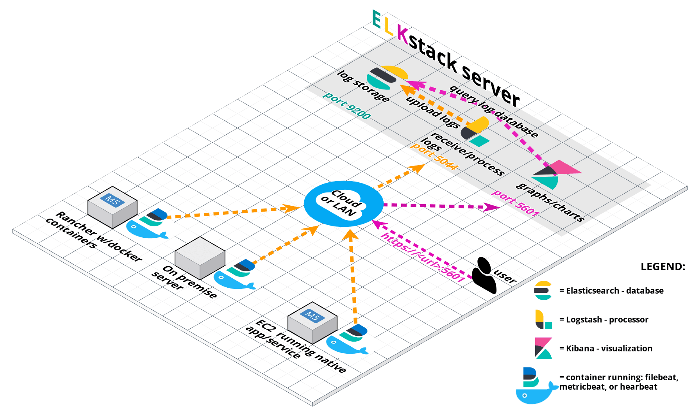
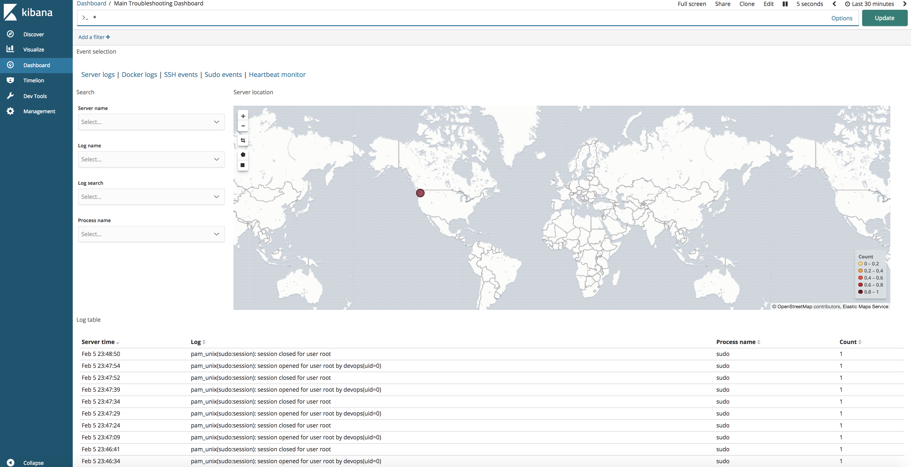
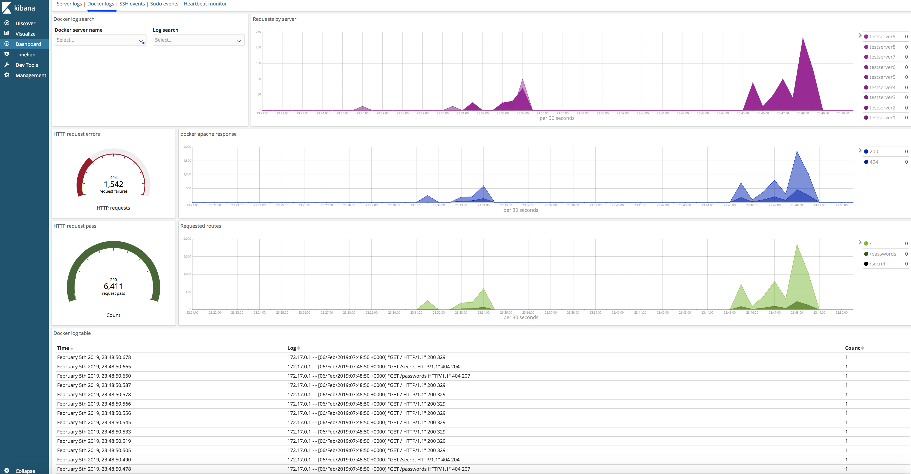
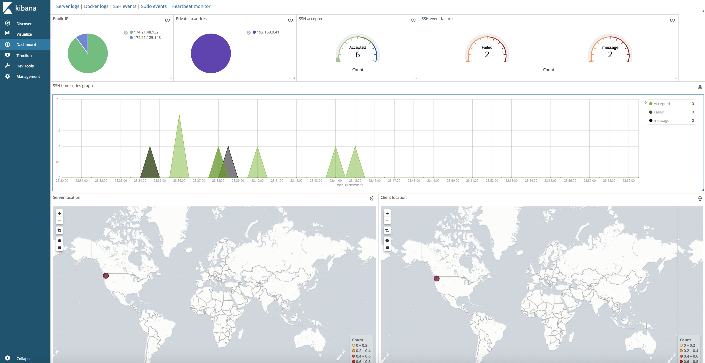
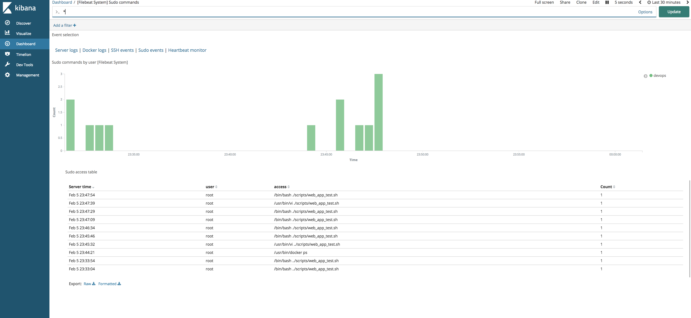

## Monitor infrastructure w/ ELK stack on docker





Official Elastic documentation: [https://www.elastic.co/](https://www.elastic.co/)
<br>

## Requirements

* Ubuntu 16.04+ [https://www.ubuntu.com/download/server](https://www.ubuntu.com/download/server)
* Docker-compose 1.16.1+ [https://docs.docker.com/compose/install/](https://docs.docker.com/compose/install/)
* Docker-ce 18.3.1+ [https://docs.docker.com/install/linux/docker-ce/ubuntu/](https://docs.docker.com/install/linux/docker-ce/ubuntu/)

<br>

## 1. Deploy monitoring stack (dockerized ELK)


a. Run the following commands on a server you wish to install ELK stack on:

```
$ cd elastic_logs
$ deploy_elk.sh <ELK_TYPE> <ELK_VERSION> <ES_MEMORY> <ES_PORTS> <LOGSTASH_MEMORY> <LOGSTASH_PORTS> <KIBANA_PORTS>
$ sudo docker ps ## to ensure all containers running

```

b. Open browser and go to http://\<SERVER\_IP\_ADDRESS\>:5601 to view kibana.

c. From the Kibana homepage click Management, click "Saved Objects", click "import", and import elastic_logs/objects/filbeat_dashboard.json

d. ELK dashboard is ready to receive system logs from log-forwarders.

e. Navigate to the Dashboards tab, and find/select "Main Troubleshooting Dashboard".

<br>


## 2. Log-forwarding agents (dockerized beats)
I've scripted/dockerized deployment of several beats monitoring agents:

* system logs: /var/log/\*.log and /var/lib/container/\*/\*.log
* system metrics: system resources including containers
* system uptime: tcp, http, or icmp (coming soon)

Official documentation and source code:
[https://github.com/elastic/beats-docker/tree/6.5](https://github.com/elastic/beats-docker/tree/6.5)

<br>
### Launch System log beats monitoring (filebeat)

a. Launch log-forwardering agent on any ubuntu server:

```
$ cd elastic_logs/filebeat/
$ sudo deploy_agent.sh <THIS_SERVERS_ETHERNET_ADAPTER> <ELK_SERVICE> \
<ELK_IP> <ELK_PORT> <THIS_SERVERS_UNIQUE_NAME>
$ sudo docker ps ## to ensure all containers running

```

<br>

## 3. View logs in Kibana
Once ELK stack and log-forwarder agent has been successfully deployed look at dashboard:

a. Open browser and go to http://\<SERVER\_IP\_ADDRESS\>:5601 to view kibana.
b. Navigate to the Dashboards tab, and find/select "Main Troubleshooting Dashboard".
c. You will see the some tabs at the top depending on what option you want to visualize. Example of what you should see below:











### Destroy filebeat agent or ELK stack

remove filbeat agent

```
$ sudo docker stop filebeat
$ sudo docker rm filebeat

```
remove ELK docker containers

```
$ sudo docker stop elastic_logs-logstash-1
$ sudo docker stop elastic_logs-elasticsearch-1
$ sudo docker stop elastic_logs-kibana-1
$ sudo docker rm elastic_logs-logstash-1
$ sudo docker rm elastic_logs-elasticsearch-1
$ sudo docker rm elastic_logs-kibana-1
```

remove every docker container

```
$ sudo docker rm -f $(sudo docker ps -a -q)

```


<br>

## Release Notes

### 1.0.1

* This project uses ELK dockerization from the following git repo:  [https://github.com/deviantony/docker-elk](https://github.com/deviantony/docker-elk) Special thanks to person, vounteers, and team for docker related work, please check their project out.
